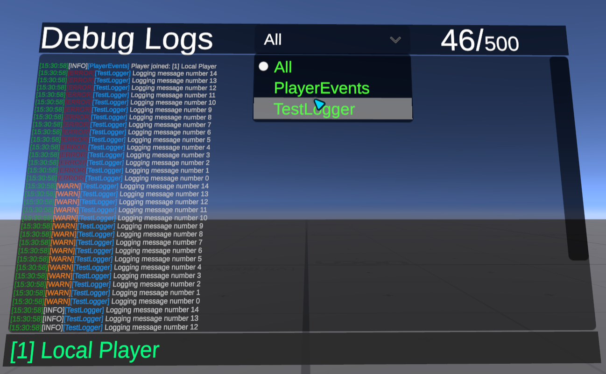

# OttLogger

A simple and easy to use and setup Console Logger for VRChat worlds.



Just import the unitypackage or do things with this repository if you are playfull.

Prefabs are provided.

Features:
- Simple to use
- Can filter logs by class/category
- Can log Join/Leave
- Can also log to console/VRC log files globally
- Unsynced

# Configuration / Usage

- Put `OttLogger` in your scene somewhere and configure it
- From your scripts, call the logger:

```csharp
// Don't forget to plug it in the inspector
public OttLogger logger;
logger.Log(this, $"Info message");
logger.LogWarn(this, $"Warn message");
logger.LogError(this, $"Error message");
```

# Help/Support

This is provided "as-is", Very GoodTM bug reports might gets answered but I have others things to do and ADHD so this is as-is if it can help anyone.

Contributions for bug fixes or features welcome though

# Credits
OttLogger System by Ottpossum/dashie.

# License
MIT License
